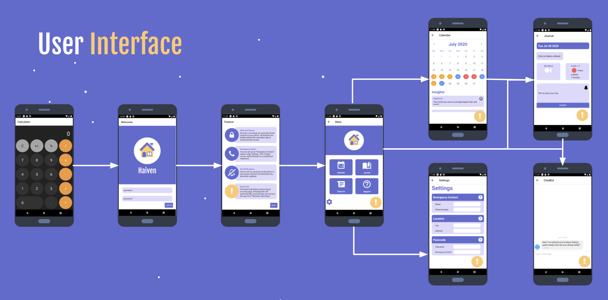
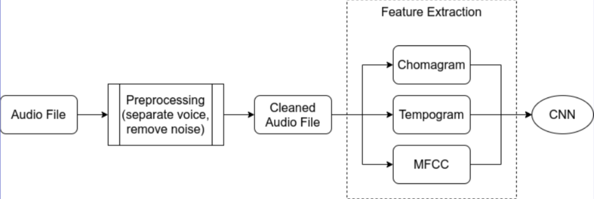
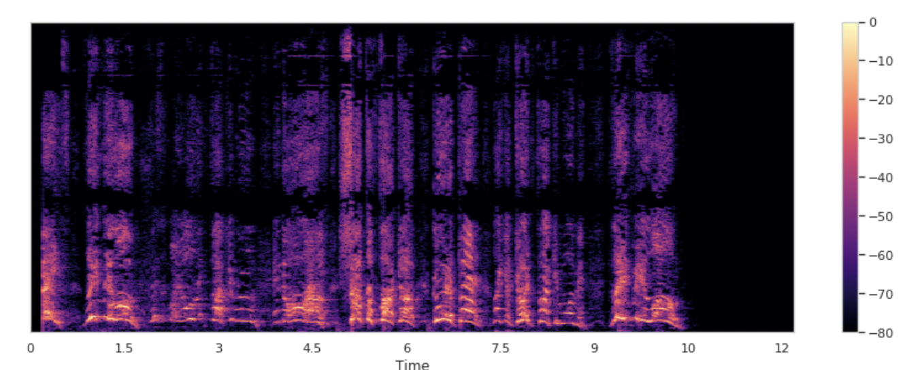
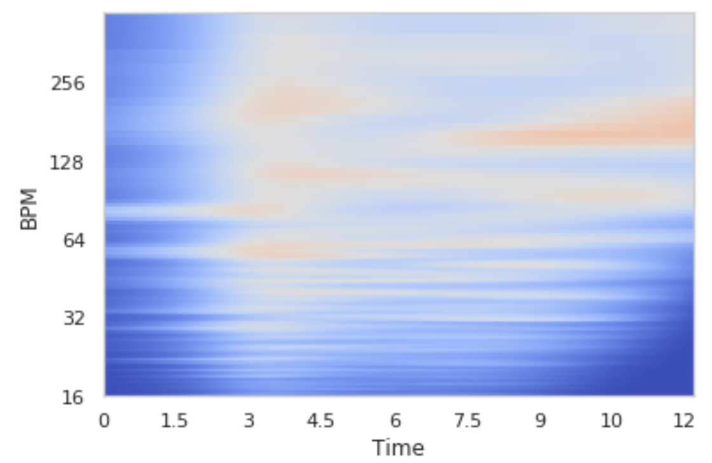
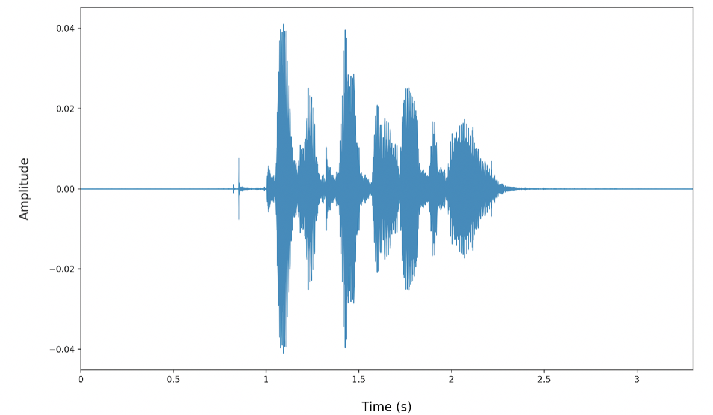
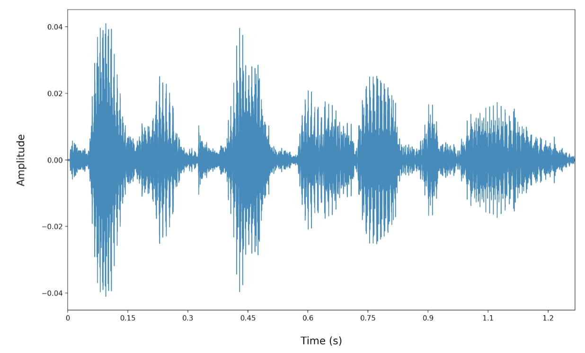
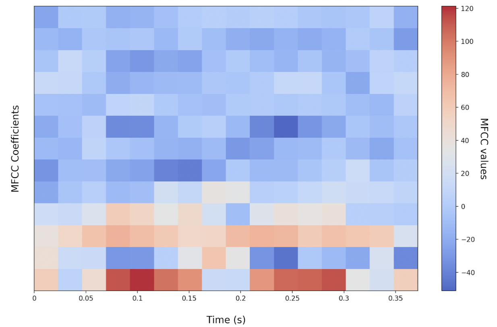

<!-- PROJECT LOGO -->
<br />
<p align="center">
  <a href="https://github.com/lilyxy/hAIven">
    
  </a>

  <h3 align="center">HAIven</h3>

  <p align="center">
    An app that makes you feel safe.
    <br />
    <a href="https://github.com/lilyxy/hAIven"><strong>Explore the docs »</strong></a>
    <br />
    <br />
    <a href="https://github.com/lilyxy/hAIven">View Demo</a>
    ·
    <a href="https://github.com/lilyxy/hAIven/issues">Report Bug</a>
    ·
    <a href="https://github.com/lilyxy/hAIven/issues">Request Feature</a>
  </p>
</p>


<!-- TABLE OF CONTENTS -->
## Table of Contents

* [About the Project](#about-the-project)
  * [User Interface](#user-interface)
* [Pipeline](#pipeline)
* [Models](#models)
  * [Aggression Detection Model](#aggression-detection-model)
  * [Audio Sentiment Analysis Model](#audio-sentiment-analysis-model)
* [Getting Started](#getting-started)
  * [Installation](#installation)
* [Contributing](#contributing)
* [Contact](#contact)
* [Acknowledgements](#acknowledgements)


<!-- ABOUT THE PROJECT -->
## About The Project

Our solution, Haiven, is a smartphone app designed to help women track their experiences with intimate partner violence. The app was envisioned as a ‘friendly neighbour’ who can overhear abusive encounters coming from next door, and check-in with the woman if they’re concerned for their safety.

Haiven automatically starts to record audio if it detects aggressive noises. Like a friendly neighbour, Haiven will check-in later in the day to make sure everything’s okay. If the audio is extremely aggressive, and Haiven is concerned for the user’s safety, an emergency contact will be immediately notified.

### User Interface
<p align="center">

</p>

<!-- PIPELINE -->
## Pipeline
<p align="center">

</p>

<!-- MODELS -->
## Models
### Aggression Detection Model
Aggression Model
* CNN models on time series features (1D and 2D)
  * Mel spectrogram
  * Intensity
  * Tempo
* Regression with features not in sequence e.g. shimmer
* Voting system for final estimation of aggression
* Accuracy: 90%

Output
* Label of aggressive or not
* Confidence probability

Dataset
* ~200 .wav files
* 5-10 seconds long
* Taken from youtube

<p align="center">

  <h4 align="center">Spectrogram</h3>
</p>
The first step of the process is to detect whether or not audio is aggressive. Haiven continually monitors audio coming into the phone and extracts various features: the spectrogram of pitches, the Mel frequency cepstral coefficients, speech tempo, energy intensity, and vocal tract parameters. These correspond to well-studied characteristics of aggression - Aggressive speech tends to have higher intensity, lower pitch, faster articulation, and increased airflow in producing vowels.   

<p align="center">

  <h4 align="center">Tempogram</h3>
</p>

Using a custom dataset of 200 5 to 10-second clips with varying aggression, we train CNNs on time-series features and regressions on the rest so that each feature predicts independently, and then use a voting system to determine a final prediction with about 90% accuracy. During application usage, we can also elect to use fewer features in detection to trade some accuracy for lower power consumption.

### Audio Sentiment Analysis Model
Audio Sentiment Analysis Model
* Convolutional Neural Network

Analysis
* Emotion Classification:
  * Neutral
  * Happy
  * Sad
  * Angry
  * Fearful
  * Disgusted
  * Surprised
* Accuracy: 85.1%

Datasets
* RAVDESS, SAVEE, TESS 
* Training data: 3238
* Testing data: 810

<p float="center">
  
  
  <h4 align="center">Separated audio file and Cleaned audio file</h3>
</p>

Each separated audio file is then cleaned by removing any dead space.

<p align="center">

  <h4 align="center">MFCC (per0.4s window)</h3>
</p>

The cleaned file is separated into windows of 0.4s, and each window is converted into a Mel-frequency cepstrum. The coefficients of this graph aim to represent distinct units of sound based on the human perception of frequencies. The values of these coefficients are then aggregated into an array for each window, and then the windows are aggregated for the entire audio file.

The resulting array is then fed into an emotion classification model. The model is a convolutional neural network that was trained on the combination of three audio emotion datasets; RAVDESS, TESS, AND SAVEE. The model takes in the pre-processed audio file and predicts the emotion of the sample. The output is one of seven classes of emotions, and our current model is able to predict emotion with 85.1% accuracy.


<!-- GETTING STARTED -->
## Getting Started

This is an example of how you may give instructions on setting up your project locally.
To get a local copy up and running follow these simple example steps.

### Installation
1. Clone the repo
```sh
git clone https://github.com/your_username_/Project-Name.git
```
2. install the required libraries
```sh
pip install -r requirements.txt 
```
3. Install dependencies
```sh
pip install
```


<!-- CONTRIBUTING -->
## Contributing

Contributions are what make the open source community such an amazing place to be learn, inspire, and create. Any contributions you make are **greatly appreciated**.

1. Fork the Project
2. Create your Feature Branch (`git checkout -b feature/AmazingFeature`)
3. Commit your Changes (`git commit -m 'Add some AmazingFeature'`)
4. Push to the Branch (`git push origin feature/AmazingFeature`)
5. Open a Pull Request


<!-- CONTACT -->
## Contact
Alexi Michael - https://github.com/michaa1 - alexi.michael.13@gmail.com.     <br />
Jenny - https://github.com/j-nnyhuang - jennyhuang.wj@gmail.com     <br />
Lily Wang - https://github.com/lilyxy - lilyxy@umich.edu    <br />
Elaine Lau - https://github.com/yunglau - tsoi.lau@mail.mcgill.ca


<!-- ACKNOWLEDGEMENTS -->
## Acknowledgements
* Sumana Basu
* Bhairav Mehta
* Zhitao Gong
* Marjan Albooyeh
* [Voice Emotion](https://github.com/alexmuhr/Voice_Emotion)
* [React Native Calculator](https://github.com/ReactNativeSchool/react-native-calculator)
